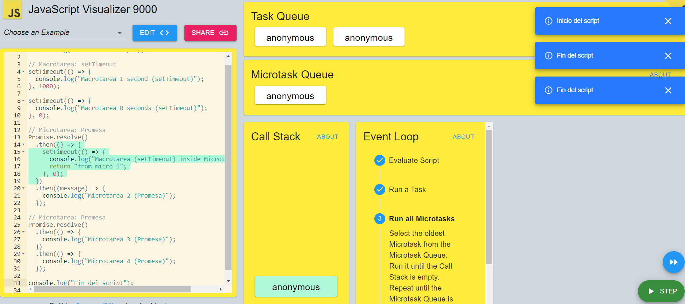

// ¿Qué tareas se consideran macrotareas y cuáles son microtareas? las tareas asincronicas son micro tareas y las funciones o weba api (tareas más complejas) son macro tareas

// ¿Cómo se relacionan las macrotareas y microtareas con el event loop? se relacion en la priorizacion de resolucion de las tareas ps el event loop prioriza las microtareas para llamarlas al call stack y despues llama a las macro, además entre ellas se pueden desencadenar más tareas

// ¿Qué sucede cuando una microtarea genera una nueva macrotarea dentro de ella? esta agrega esta amcro tarea a la cola de macro tareas, ademas depende si tiene delay o no

// ¿Cómo se manejan las promesas y los setTimeout en relación con el event loop? como las promesas son asincronicas entonces estás se priorizan porque son microtareas para ejecutar una vez el call stack esta vacio, ya una vez el call stack y la cola de micro tareas esta vacie entonces se ejecutan las funciones macro que estan almacenadas en la cola de tareas

